# Video2Notes UI 方向探索

这一组图片用于选择 Video2Notes 下一轮 React/Tauri 桌面端的视觉方向，不是最终页面，也不会直接照搬图片中的生成文字。

所有方案使用同一功能基线：

- `New task / Running / Notes / Models` 主导航
- 视频预览和真实时间码
- 可阅读的结构化笔记
- `Speech / Screen text / Visual change` 证据
- `Fast / Balanced / Accurate` 模式
- 时间轴、关键帧与导出

选择时可以直接告诉 Codex：

> 我最喜欢 14；采用 14 的布局和时间轴、03 的字体密度、01 的浅色材质，并保留 07 的红色播放头。

也可以给每张图分别打分：

- 整体风格：1–10
- 布局：1–10
- 颜色：1–10
- 信息密度：过低 / 合适 / 过高
- 最想保留的部分
- 最不喜欢的部分

## 01 · Pearl Glass

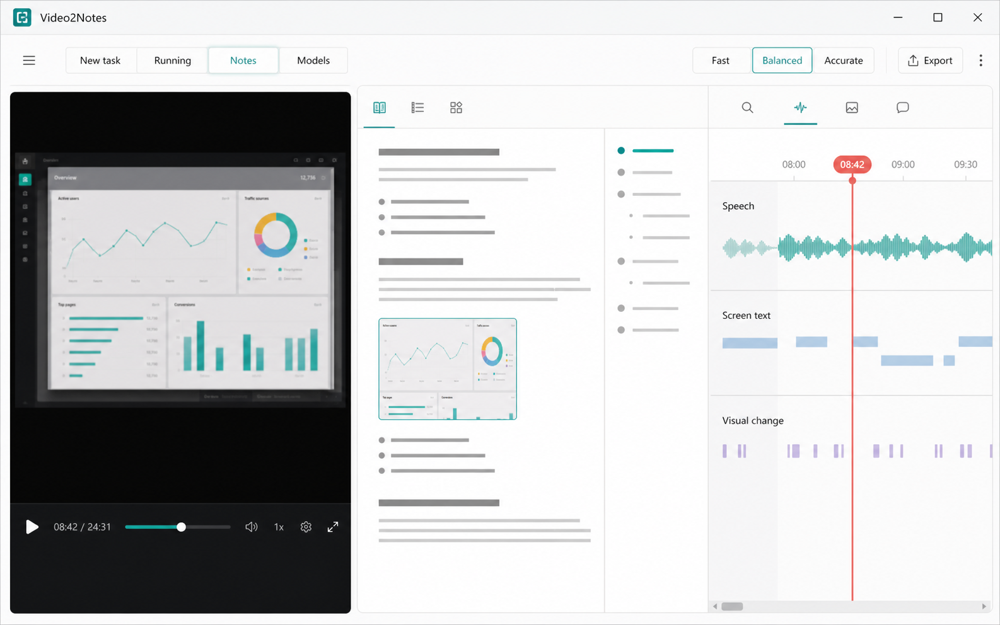

明亮珍珠白与冰灰、局部轻玻璃、青绿色状态和珊瑚色时间游标。强调轻盈、留白和高级桌面生产力感。

## 02 · Obsidian Cinema

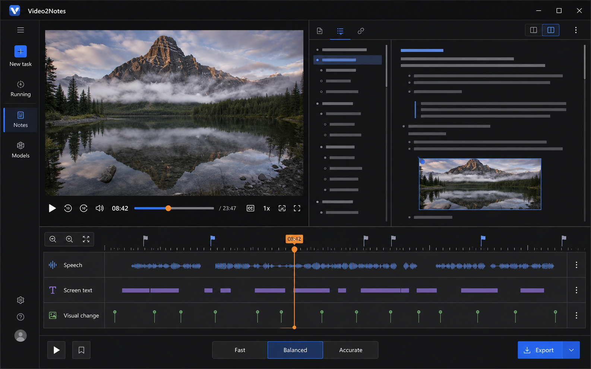

深黑石墨色视频优先工作台，暖白正文、电蓝状态和橙色播放头。强调沉浸观看与专业剪辑工具感。

## 03 · Precision Monochrome

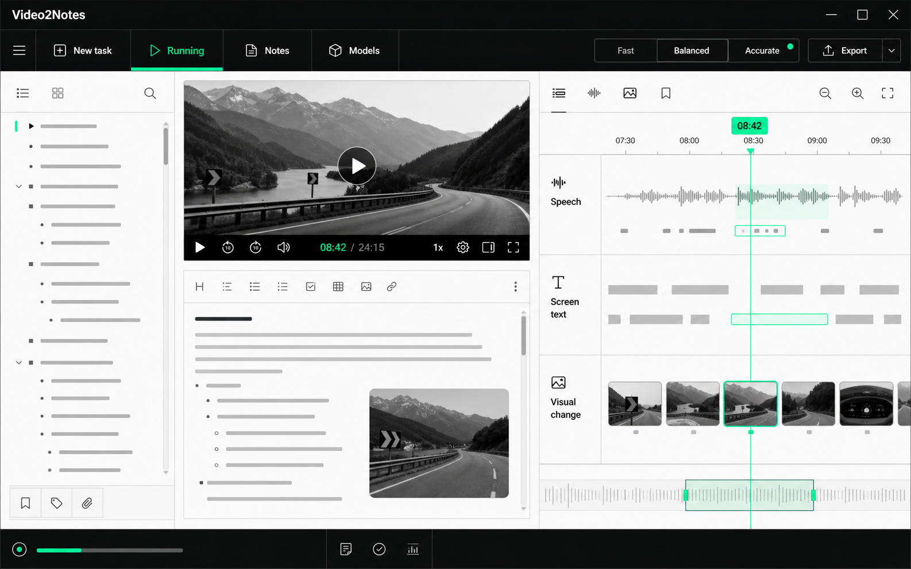

高精度黑白灰、细网格和少量酸性青绿。强调快速、克制、类似 Linear/Vercel 的工程工具气质。

## 04 · Warm Editorial

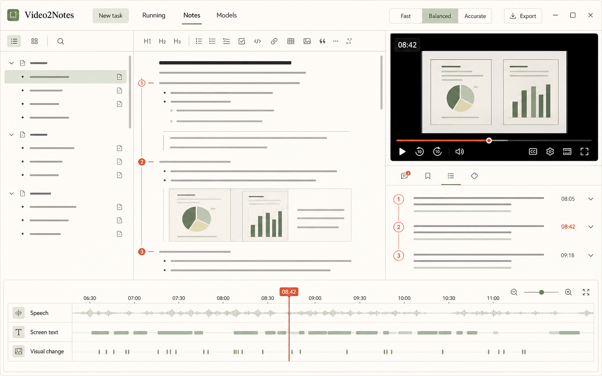

象牙纸色、墨黑、鼠尾草绿与赭红，衬线标题和编辑批注式证据。强调长时间阅读和研究笔记感。

## 05 · Spatial Command

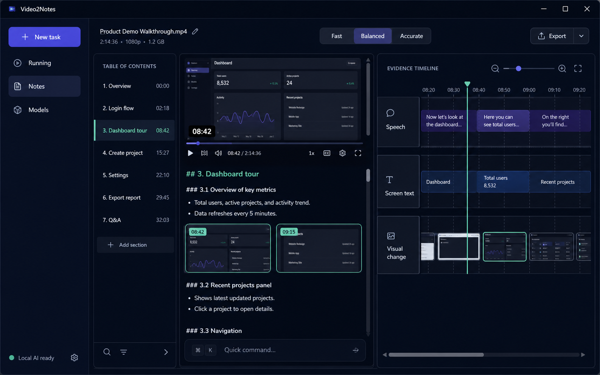

夜蓝黑、命令条、可折叠 dock 和少量紫蓝/薄荷光晕。强调空间层次、快捷操作和流畅高级感。

## 06 · Fluent Mica

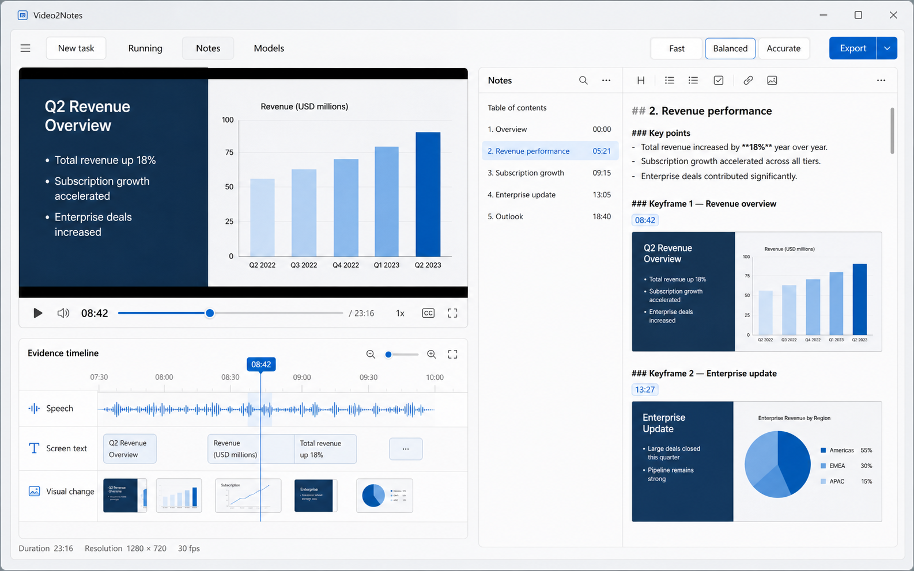

现代 Windows Fluent 2 / Mica 方向。强调原生 Windows 亲和力、系统级交互和清晰 focus state。

## 07 · Swiss Signal

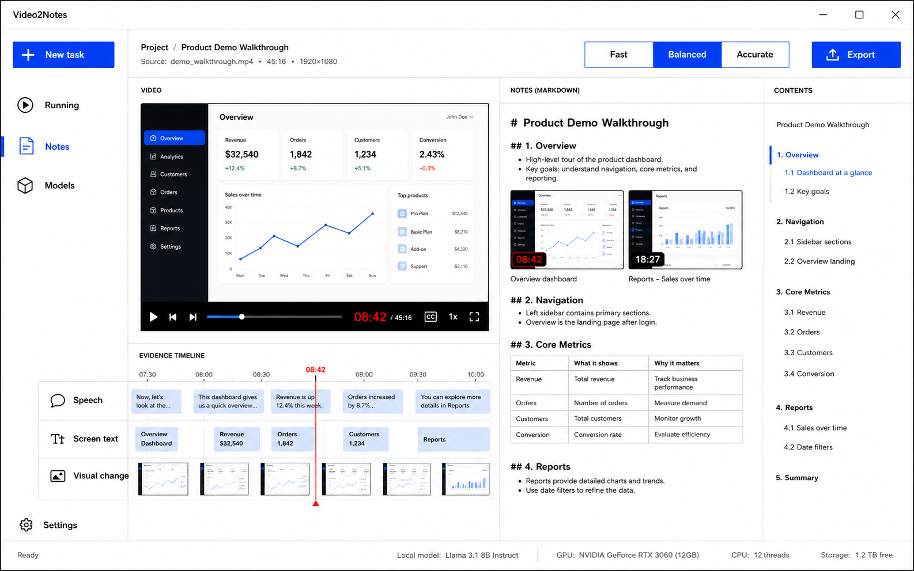

白底、深墨、cobalt blue 与 signal red，排版和网格驱动。强调信息设计、时间码和强识别度。

## 08 · Soft Brutalist

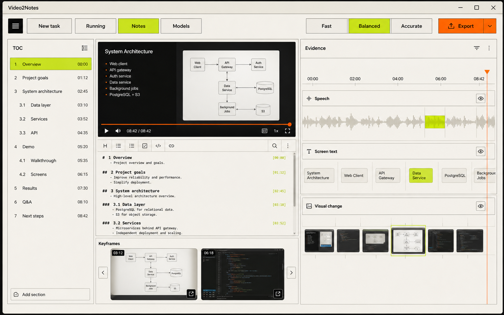

奶油灰、煤黑粗线、荧光橙与莱姆点缀。强调非对称、直接控制和有辨识度的新粗野主义。

## 09 · Calm Bento

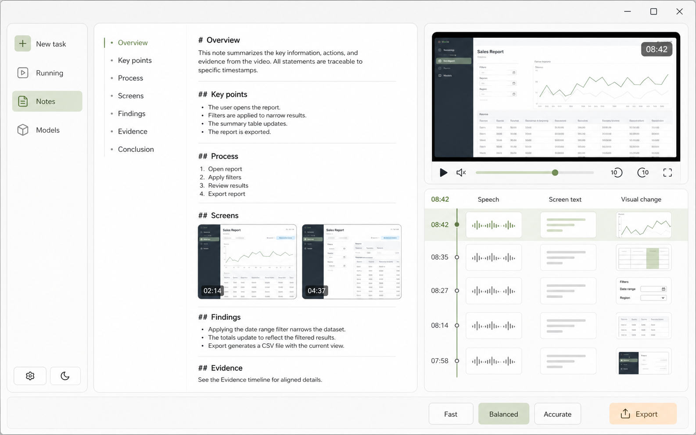

骨白、石墨、鼠尾草与浅杏，大区域 bento 而非嵌套卡片。强调舒适、亲和和功能与呼吸感平衡。

## 10 · Data Studio

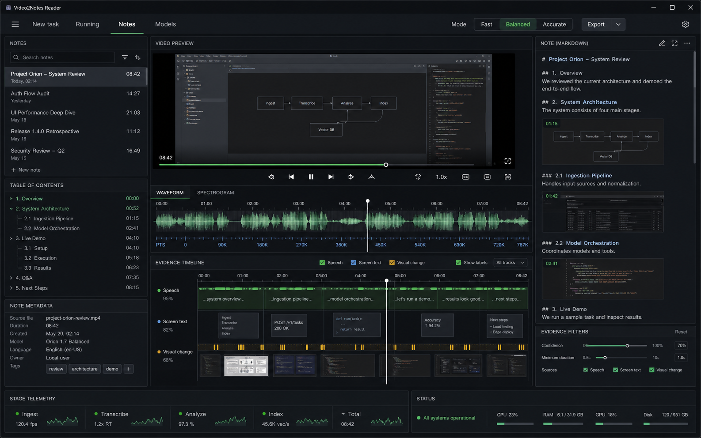

深石墨、绿色/青色状态、琥珀警告，展示 waveform、PTS、stage telemetry 和 evidence filters。强调专家效率。

## 11 · Aurora Luminous

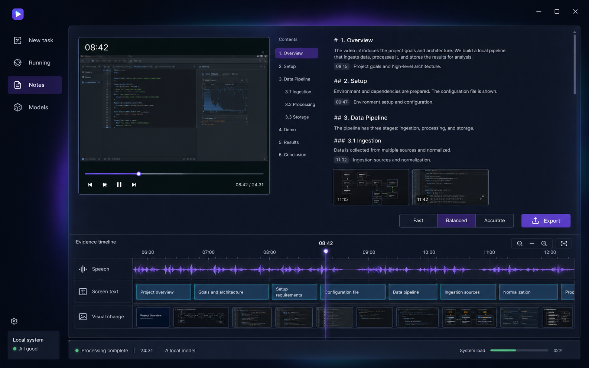

暗靛蓝、低饱和青紫 aurora 光和高对比正文。强调未来感与流畅动效，但避免游戏 HUD 和霓虹滥用。

## 12 · Japanese Quiet

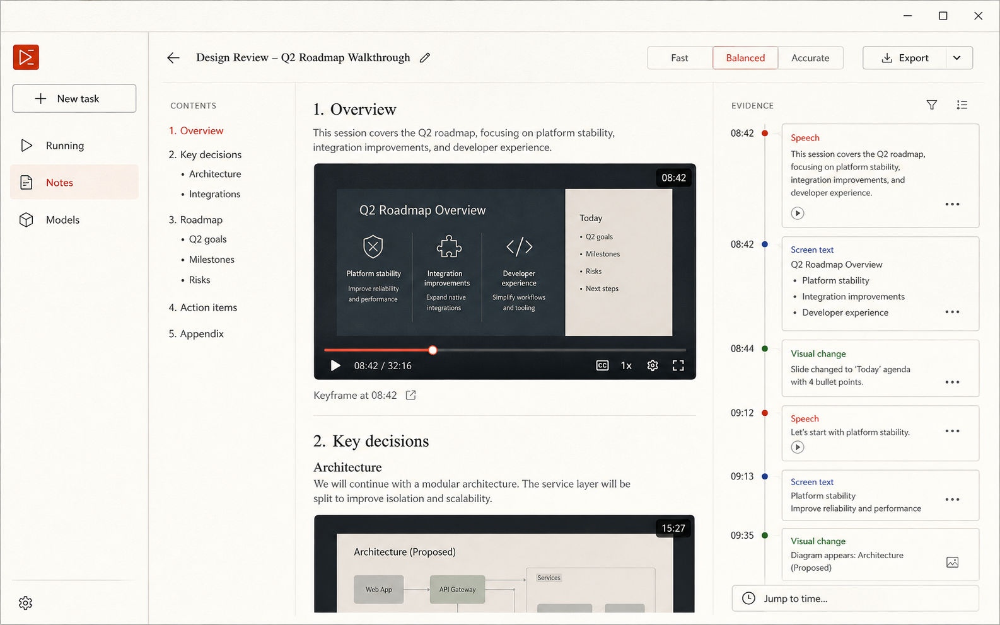

暖白、炭墨、灰蓝和一点朱红，规则线、细空白与编辑排版。强调宁静、克制和长期专注。

## 13 · Material Expressive

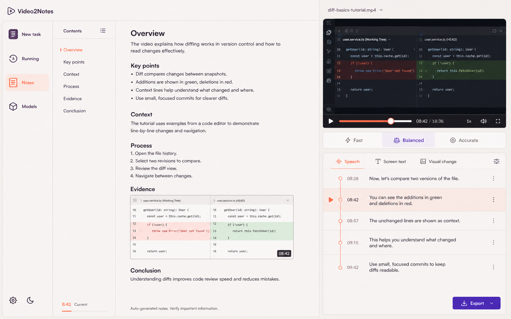

珍珠灰、深茄紫、珊瑚和电紫，少量可变圆角与 tonal elevation。强调友好、现代和有表现力的创作工具。

## 14 · Immersive Timeline

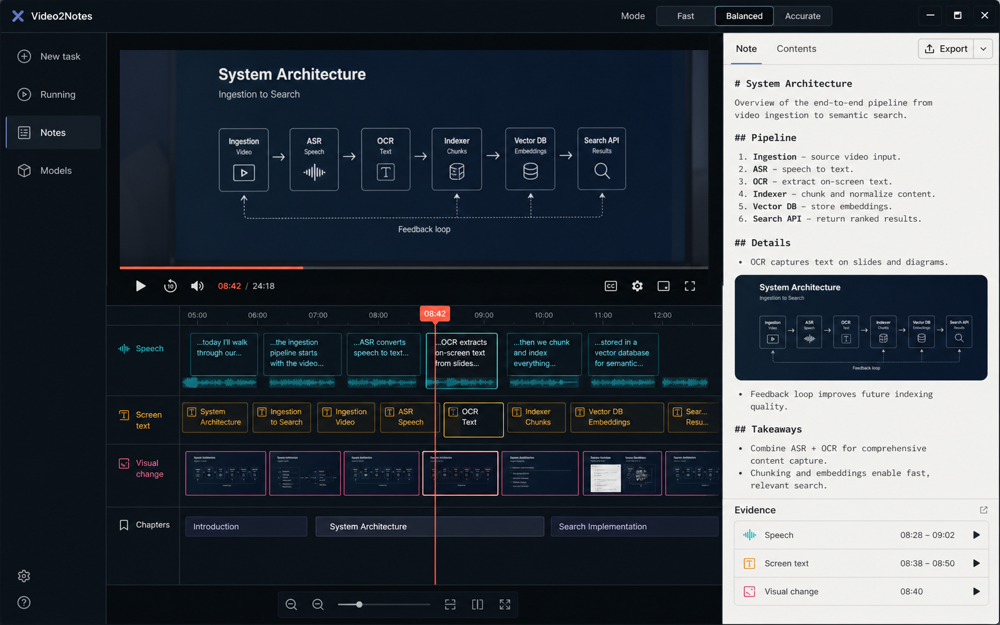

深蓝黑色视频与多轨 PTS 时间轴占主导，右侧为连续笔记。强调 Video2Notes 的语音、屏幕文字、视觉变化同步能力。

