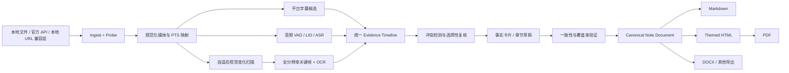

# Video2Notes 系统架构

状态：设计基线（2026-07-28）  
核心原则：**先建立可追溯证据，再写笔记。**

## 一、产品范围

### 必须做到

- 首要输出为结构清晰、可独立保存的 Markdown；
- 支持本地视频文件；
- 对 Bilibili、YouTube、X 提供明确分级的连接器；
- 尽可能保存平台字幕、音频、屏幕文字和画面状态；
- 所有语音、OCR、关键帧和章节共享一个物理时间轴；
- 每条被系统纠正或总结的信息都能追溯到原始 evidence；
- 模型供应商先统一登记，再按处理角色独立选择；
- 能在核显笔记本到高端 GPU 上选择不同速度/精度 profile；
- 后续从同一份内容模型生成 HTML、PDF、DOCX 等格式。

### 明确不做

- 不承诺下载任意互联网视频；
- 不绕过 DRM、付费墙、地区限制、封禁或用户无权访问的内容；
- 不把用户平台 Cookie 上传到云端；
- 不在嵌入式 WebView 或自动化浏览器中收集账号密码；
- 不把“固定每 N 秒一帧”当作最终信息提取方案；
- 不让 LLM 无证据地修订 transcript 或 OCR；
- 不以一个无法解释的“总置信度”掩盖各来源的差异。

## 二、顶层数据流



处理顺序并不要求完全串行。音频和视觉可以并行；只有 fusion 必须等两边产生带 PTS 的证据。

## 三、获取层与账号登录

### SourceAdapter

所有输入都实现同一接口：

```text
SourceAdapter
  probe(input, auth_context) -> SourceManifest
  acquire(manifest, format_policy) -> LocalMediaAsset
  cleanup() -> void
```

`SourceManifest` 至少包含：

```text
platform / canonical_url / source_id
title / author / publish_time / description / tags
auth_mode
rights_basis
available_video_formats[]
available_audio_formats[]
subtitles[]
selected_formats
width / height / fps / codec / bitrate / duration
is_live / is_drm / is_private_or_protected
quality_warning
temporary_url_expiry
```

绝不静默降清晰度。若只获得 360p/480p，界面和笔记元数据都必须显示，因为这会直接限制小字号 OCR 的上限。

### 获取优先级

1. 用户本地文件；
2. 平台官方导出或官方 API；
3. 无登录公开访问探测；
4. 用户显式启用的本地浏览器 Cookie 兼容模式；
5. 失败后提示上传原文件，不继续尝试更激进的绕过手段。

截至 2026-07-28，[yt-dlp](https://github.com/yt-dlp/yt-dlp) 仍覆盖 Bilibili、YouTube 和 X，适合放在隔离的本地 sidecar；但不能把它等同于平台授权。YouTube 完整支持还依赖 `yt-dlp-ejs`、JS runtime，并越来越受 PO Token 影响，详见 [yt-dlp PO Token Guide](https://github.com/yt-dlp/yt-dlp/wiki/Po-Token-Guide)。

平台定位：

| 平台 | 建议 |
|---|---|
| 本地文件 | MVP 与生产默认入口 |
| Bilibili | 本地单条 URL 实验连接器；正式商业化前申请平台许可/法律审查 |
| YouTube | 优先用户自己的 Studio/Takeout 文件；第三方 URL 仅本地实验兼容层 |
| X | 优先官方 X API v2 Post Lookup + media variants + OAuth 2.0 PKCE |

### 真实浏览器登录

原生 OAuth 应使用系统外部浏览器和 PKCE，而不是嵌入式 WebView；这是 [RFC 8252](https://datatracker.ietf.org/doc/html/rfc8252) 的原生应用最佳实践。

```text
官方 OAuth 可用
  → 系统默认浏览器
  → 官方站点登录
  → Authorization Code + PKCE
  → localhost / custom scheme 回调
  → OS Credential Store

无官方媒体 OAuth、用户启用本地兼容模式
  → 用户现有 Chrome / Edge / Firefox
  → 用户自行登录官方站点
  → 应用按任务读取指定平台/Profile 的必要 Cookie
  → 本机 sidecar 获取单个媒体
  → 内存与临时 cookie jar 立即清理
```

安全硬规则：

- 永远不收账号密码；
- Cookie/token 不进入日志、遥测、崩溃报告和任务 JSON；
- 后端 API 只返回“已连接/失效”，不返回 secret 原值；
- 需要持久化时使用 Windows Credential Manager/DPAPI、macOS Keychain 或 Linux Secret Service；
- 浏览器扩展采用按域名的 optional host permission，不使用 BiliNote 当前的 `*://*/*` 全站权限；
- 扩展与本地服务用一次性配对 token；仅接受 loopback；
- 捕获到验证码、账号验证、403 或风控后停止重试；
- sidecar 不允许用户透传任意 `yt-dlp` 参数、输出模板、external downloader 或 `--exec`。

平台条款会变化，正式发布前必须再次核验：

- [Bilibili 用户协议](https://www.bilibili.com/blackboard/user-rule-linux.html?night=1&padding=0)
- [YouTube 服务条款](https://www.youtube.com/static?template=terms)
- [YouTube API Developer Policies](https://developers.google.com/youtube/terms/developer-policies)
- [X Terms of Service](https://x.com/en/tos)

## 四、唯一物理时间真值

### 为什么必须用 PTS

视频可能是 VFR；音频、视频可能从不同 PTS 开始；DASH 合并可能产生 offset；“第 N 帧 ÷ 名义 FPS”不总是实际播放时间。

因此：

- 保存每条原始 stream 的 `time_base`、`start_time`、PTS/DTS；
- 以 presentation timestamp 映射到内部 `time_us: int64`；
- stage 内可用毫秒显示，但持久化使用微秒或原始 rational；
- ASR/VAD 的秒数映射回规范时间轴；
- 关键帧保留原始 frame PTS；
- 合并后用 `ffprobe` 检查音视频起点、时长和 drift。

FFmpeg 文档明确说明 presentation time 等于 `pts * time_base`：[FFmpeg documentation](https://www.ffmpeg.org/ffmpeg-all.html)。

WhisperX/forced alignment 只能收紧词级区间，不能反过来改写容器的物理时间。

## 五、视觉变化检测

### 不采用的方案

- 直接每 5/10 秒截一帧；
- 把每一帧送给便宜 VLM；
- 只做镜头切换；
- 只比较全局直方图；
- 只比较 OCR 字符串；
- JPEG MD5 去重。

这些方法分别会漏渐进文字、成本过高、漏镜头内变化、被局部变化/运动干扰、在 OCR 失败时失明或对压缩噪声过敏。

### 分层事件采样

```text
Pass 0：容器与 stream 探测
Pass 1：低分辨率顺序解码
  ├─ 全局 luma/HSV/histogram
  ├─ 边缘与局部 tile 变化
  ├─ SSIM / perceptual hash
  ├─ 光流或全局运动补偿后的残差
  └─ PySceneDetect / TransNetV2 镜头候选

Pass 2：文字/UI 专用变化
  ├─ text detector mask
  ├─ 字幕/弹幕/水印/人脸/鼠标 overlay mask
  ├─ box tracking
  ├─ 新增/消失文字区域
  └─ 稳定平台检测

Pass 3：候选窗口精扫
  ├─ 原始分辨率或更高分析分辨率
  ├─ 变化边界细化
  ├─ 清晰度、遮挡、OCR confidence 打分
  └─ 选择稳定关键帧
```

[PySceneDetect AdaptiveDetector](https://www.scenedetect.com/docs/latest/api/detectors.html) 和 [TransNetV2](https://github.com/soCzech/TransNetV2) 适合产出镜头边界候选，但它们不能替代文字 mask 内的状态变化检测。

### 文字变化是“状态”，不只是“峰值”

重要事件通常表现为：

- 某一刻变化；
- 随后持续若干帧；
- 画面稳定；
- 新状态与上一个稳定状态有足够差异。

这可以过滤鼠标闪动、压缩噪声、单帧转场和短暂弹幕。当前 `src/video2notes/vision/adaptive_sampler.py` 已实现这一基线：

- 3 FPS 粗扫；
- 全局与稀疏边缘变化并行评分；
- 持久性与稳定窗口；
- 只在候选窗口做 12 FPS 精扫；
- 选稳定窗口内最清晰帧；
- 从原视频提取预览。

生产版还需要加入 text detector mask、运动补偿和真实 PTS。

### 滚动和逐字/逐项出现

滚屏不能把每个瞬间都作为笔记图片。应维护 OCR token/box 的时间状态：

```text
new_tokens = tokens(current) - matched_tokens(previous_states)
```

对一个滚动区间做 set-cover：用尽可能少的清晰帧覆盖尽可能多的唯一 OCR token，同时保持阅读顺序。逐项出现的 PPT 可保留最终完整状态，也可在讲解顺序重要时保留中间状态；由 transcript 中的指示词和新增内容决定。

### OCR

候选关键帧才运行全分辨率 OCR：

1. 原图 text detection；
2. 必要时方向、透视、裁切、去噪；
3. 按脚本/语言选择 recognition；
4. 保存 box、line、token、confidence；
5. 相邻状态按空间 IoU + 文本编辑距离追踪；
6. 低置信 crop 才升级到更强 OCR/VLM；
7. 永远保留 raw OCR 和 corrected OCR。

当前可优先评测 PaddleOCR 的 PP-OCRv6/PP-OCRv5；官方文档显示 PP-OCRv6 提供 tiny/small/medium，多语言模型覆盖约 50 种语言：[PaddleOCR General OCR](https://www.paddleocr.ai/latest/en/version3.x/pipeline_usage/OCR.html)。

对 360p 中已经不可辨认的小字，系统必须输出 `unreadable`/低置信，而不是让 VLM“猜”。

## 六、音频、语言与多 ASR

### 基础流程

```text
原始音轨
  → 规范化 16 kHz mono 工作副本（保留原轨）
  → VAD
  → 短窗语言识别 / code-switch 候选
  → primary ASR（word timestamps + confidence）
  → forced alignment
  → speaker diarization（需要时）
  → 低置信/冲突窗口 secondary ASR
  → 时间约束的候选融合
```

可评测的本地基线：

- [faster-whisper](https://github.com/SYSTRAN/faster-whisper)：CTranslate2、批处理、VAD、word timestamps；
- Whisper `large-v3`/`large-v3-turbo`；
- [FunASR Paraformer-Large](https://github.com/modelscope/FunASR)：作为中文/B 站语料上的异构候选，支持 VAD、标点、时间戳和 hotword；它与 Whisper 的错误分布更可能互补；
- [WhisperX](https://github.com/Likh-Alex/whisperx)：VAD + forced alignment + word-level timestamps；
- [pyannote.audio](https://github.com/pyannote/pyannote-audio) `community-1`：本地 speaker diarization。

Whisper 与 Paraformer 谁做中文 primary 不能凭供应商宣传决定，必须在本项目的 B 站金标集上比较；另一个只在低置信片段选择性复核。

云 API 作为同一 `ASRProvider` 接口的实现。比如 OpenAI 当前 Transcription API 提供 `gpt-4o-transcribe`、mini 和 diarize 变体；普通转写可返回 token logprobs，diarize 变体返回 speaker segment，但两者支持的 timestamp/confidence 字段不同，adapter 必须显式表达，不能假装能力相同：[OpenAI Audio API](https://platform.openai.com/docs/api-reference/audio)。

### 多语言

整个视频只保存一个 `language` 不够。推荐：

- 先按 VAD 形成声学片段；
- 每 5–20 秒计算语言 posterior；
- 相邻同语言片段合并；
- 高熵或疑似 code-switch 窗口使用 multilingual ASR；
- OCR script、标题/简介/tags 形成 glossary/hotwords；
- 原语言 transcript 与翻译分开保存；
- 不把翻译文本覆盖原文。

### 什么时候跑第二个 ASR

不要默认把一小时视频完整送给多个 API。触发 secondary 的条件包括：

- primary token/word confidence 低；
- `no_speech` 与 VAD 冲突；
- platform caption 与 primary 在同一时间窗差异大；
- language posterior 高熵；
- 专有名词与同时间 OCR/metadata glossary 冲突；
- 音乐、重叠说话、强噪声；
- 章节摘要验证发现关键 claim 缺少可靠语音证据。

### 如何选择相信谁

先对齐，后判断：

1. 按时间交叠将候选限制在同一 speech window；
2. 做 token/word alignment；
3. 将 provider confidence 做语料校准，不能直接比较不同厂商的原始 `0.9`；
4. 可用 NIST ROVER/混淆网络做同源 ASR 假设组合；
5. platform 人工字幕通常优先级高于自动字幕，但仍保留来源类型；
6. OCR 与 ASR通常是互补信息，不应把两者当成对同一句话的多数投票；
7. 只在自动规则仍无法裁决时，把短冲突窗口、音频、上下文和候选交给高精度 adjudicator；
8. 裁决结果记录所选候选、被拒候选、规则/模型版本和置信度。

[NIST ROVER](https://www.nist.gov/publications/post-processing-system-yield-reduced-word-error-rates-recognizer-output-voting-error) 证明了多个 ASR 输出对齐和投票可以降低错误率，但是否改善取决于系统差异、对齐和置信度校准，不能保证“引擎越多越准”。

## 七、统一 Evidence Timeline

建议的最小逻辑结构：

```text
EvidenceSpan
  id
  run_id
  modality: platform_caption | asr | ocr | visual | metadata
  start_us / end_us
  language
  raw_text
  normalized_text
  confidence
  confidence_kind
  provider / model / version
  artifact_refs[]
  bbox[]                  # OCR/visual 可选
  speaker                 # ASR 可选
  parent_hypothesis_id
  correction_of
  provenance
```

视觉状态：

```text
VisualState
  start_us / end_us
  transition_us / stable_keyframe_us
  keyframe_artifact
  change_reason
  ocr_span_ids[]
  masks
  quality
```

融合单元不是固定 30 秒窗口，而是由下列边界共同决定：

- speech pause/topic boundary；
- visual state boundary；
- platform chapter；
- 最大上下文预算。

窗口内按 interval overlap 关联，而不是“离得最近就算对应”。语义模型可以在一个有界窗口内判断“讲者是否在解释这张图”，但不能改写物理时间。

## 八、模型注册与角色路由

Provider 配置必须拆成三层：

```text
Provider
  endpoint / credential_ref / privacy / locality

Model
  model_id / modalities / context / JSON schema / image limits
  cost / concurrency / latency class / data policy

RoleBinding
  task_role → primary model → fallbacks → escalation rule
```

角色建议：

| Role | 默认性质 |
|---|---|
| `vision.change_detector` | 本地确定性算法/小模型，不用 LLM |
| `vision.text_detector` | 本地 OCR detector |
| `vision.frame_explainer` | 低成本 VLM，只看少量关键帧 |
| `ocr.primary` | 本地 OCR |
| `ocr.escalation` | 更强 OCR/VLM，只处理低置信 crop |
| `asr.primary` | 本地或云 ASR |
| `asr.secondary` | 与 primary 错误分布不同 |
| `asr.adjudicator` | 只处理冲突窗口 |
| `notes.fact_extractor` | 结构化 JSON、低温度 |
| `notes.drafter` | 长上下文和中文写作能力强 |
| `notes.verifier` | 对 claim 与 evidence 做 entailment/coverage 检查 |
| `translation` | 可选，保持原文与译文分离 |

路由不能只看用户选的供应商，还要验证模型能力。若用户把纯文本模型绑定到 `frame_explainer`，配置保存时就应失败。

示例见 `config/profiles.example.yaml`。

## 九、从证据生成笔记

### 不直接对整份 transcript 一次总结

推荐四层：

1. **Evidence blocks**：同一时间窗的语音、OCR、关键帧；
2. **Fact cards**：原子事实、步骤、定义、引用、证据 ID；
3. **Section draft**：按主题组织 fact cards；
4. **Document review**：去重、章节连接、覆盖率与 claim support。

每个 Markdown 章节在 sidecar manifest 中保存 `evidence_ids`。用户看到的正文不必充满机器标记，但可以点击时间戳回原片；调试/审计视图能看到每条 claim 的来源。

验证器检查：

- 草稿中的可验证 claim 是否至少有一个证据；
- 数字、人名、术语、代码是否与原证据一致；
- OCR-only 信息是否被当成讲者观点；
- 翻译是否误覆盖原文；
- 截图是否来自同一证据窗口；
- 是否遗漏高置信且高重要度的 fact card。

## 十、截图选择

截图功能可以实验性上线，但选择依据必须可解释：

```text
value =
  visual_novelty
  + unique_ocr_information
  + transcript_deictic_signal（“这里/如下/点击”）
  + procedural_step_value
  + diagram_or_code_value
  - redundancy
  - blur
  - occlusion
  - transient_overlay
```

先用规则打分，VLM 只在候选之间判断教学价值和生成 caption。每章设预算，避免“每有变化就塞图”。

## 十一、Markdown、HTML 与 PDF

LLM 只生成结构化 `NoteDocument`/章节内容，程序负责格式：

```text
Canonical NoteDocument
  → Markdown renderer（首要交付）
  → Markdown AST / HTML template + CSS
  → Playwright Chromium page.pdf()
  → PDF
```

[Pandoc](https://pandoc.org/getting-started.html) 可作为 Markdown/HTML/DOCX 互转和 AST/filter 工具；视觉一致的 PDF 首选 themed HTML + print CSS + [Playwright `page.pdf()`](https://playwright.dev/docs/api/class-page#page-pdf)。这样 Markdown、HTML、PDF 不会出现四套内容。

PDF/HTML renderer 还应处理：

- 中文字体嵌入；
- 代码高亮；
- KaTeX/MathJax；
- 图片本地化与 alt text；
- A4/Letter print CSS；
- 目录、页眉页脚、页码；
- 长表格与分页；
- tagged PDF/可访问性。

## 十二、Stage Artifact 架构

每个任务有独立目录，杜绝 BiliNote 的共享帧目录竞争：

```text
artifacts/<run_id>/
  manifest.json
  source/
  media/
  subtitles/
  audio/
  asr/
  vision/
  ocr/
  fusion/
  notes/
  render/
  logs/
```

每个 stage manifest 记录：

```text
stage_name / stage_version
input_artifact_hashes
config_hash
provider/model/version
started_at / finished_at
wall_time / cpu_time / gpu_peak / api_cost
output_artifact_hashes
quality/confidence summary
warnings
status / retryability
```

相同 source hash、stage version 和 config hash 可以复用缓存；升级 OCR 或 summary model 只重跑下游。

## 十三、建议实现技术栈

- Engine：Python 3.12（媒体、ML、OCR 生态）；
- API：FastAPI；
- Metadata：SQLite 起步，迁移接口兼容 PostgreSQL；
- Artifact store：本地文件起步，内容寻址；
- Desktop：Tauri 2；
- Web：React/TypeScript；
- Browser companion：MV3，最小 optional permissions；
- Media：FFmpeg/FFprobe；
- Downloader sidecar：固定版本 `yt-dlp`，隔离进程；
- OCR：PaddleOCR 作为首个评测对象，接口允许替换；
- ASR：faster-whisper/WhisperX + 云 provider adapter；
- Rendering：Markdown AST + HTML/CSS + Playwright PDF。

该技术栈不要求完整复制 BiliNote；可按许可证选择性迁移其 UI/适配器思想。
